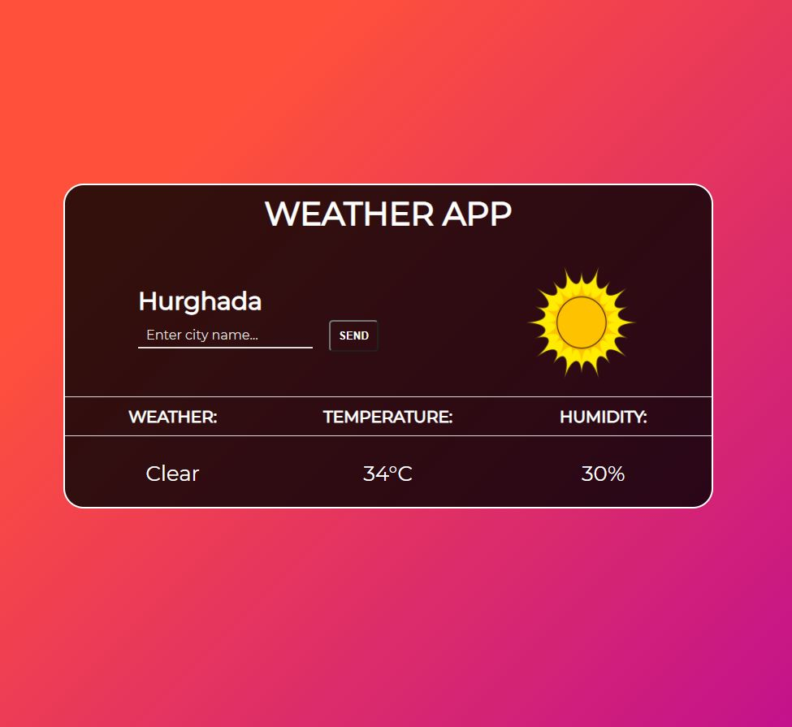

# Weather App
Simple weather app showing temperature, type of weather, and humidity :smiley:

## How to use

Enter name of city and press "Send" button, right after you will see result :grin: :muscle:

 

## How it looks
This is example how app looks like:

 

## Technologies
- HTML
- CSS
- JavaScript
- Axios

 

## Projekt Demo
[Weather App](https://tomsz24.github.io/weather-app/.)
